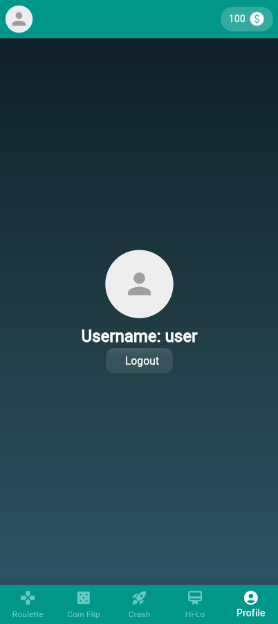

# hsma_cpd_project - Wettapp

Die Wettapp ist eine mobile Anwendung, die mit Flutter/Dart entwickelt wurde. Sie bietet den Benutzern eine Vielzahl von Minispielen, bei denen sie wetten und gewinnen können.

### Anmeldung und Registrierung

Bevor Sie die Spiele spielen können, müssen Sie sich anmelden oder registrieren. Dies stellt sicher, dass Ihre Spielstände und Gewinne sicher gespeichert werden.

| login                      | register                         | profile                        | coins                      |
| -------------------------- | -------------------------------- | ------------------------------ | -------------------------- |
|  |  |  |  |

## Spiele

Die App bietet vier verschiedene Minispiele:

### Roulette:

Bei diesem Spiel legen Sie einen Einsatz fest und wählen dann zwischen Rot, Schwarz oder Grün. Wenn Ihre Wahl trifft, haben Sie gewonnen und erhalten mindestens den doppelten Betrag Ihres Einsatzes.


### Coin:

Bei diesem Spiel legen Sie den Spieleinsatz fest und wählen zwischen Kopf und Zahl. Wenn die Münze das zeigt, was Sie gewählt haben, haben Sie gewonnen und erhalten den doppelten Betrag Ihres Einsatzes.


### HiLo:

Bei diesem Spiel setzen Sie einen Spieleinsatz und wählen, ob die nächste Karte höher, niedriger oder ein Joker ist.


### Game Crash:

Bei diesem Spiel crasht man eine Rakete gegen eine Kurve. Die Details dieses Spiels sind noch zu klären.


## Installation

Um die App zu installieren, folgen Sie diese Anweisungen

```bash
# Installiere die Abhängigkeiten
$ flutter pub get

# Build für Android
$ flutter build apk

# Starte die App in development mod
$ flutter run -d chrome
```

Viel Spaß beim Spielen und Wetten!
